* Table of Contents
  {:toc}

--------------------------------------------------------------------------------------------------------------------

## **Acknowledgements**

* Libraries used: [JavaFX](https://openjfx.io), [Jackson](https://github.com/FasterXML/jackson), [JUnit5](https://github.com/junit-team/junit5). <br>
* This project is based on the AddressBook-Level3 project created by the [SE-EDU initiative](https://se-education.org).


--------------------------------------------------------------------------------------------------------------------

## **Setting up, getting started**

Refer to the guide [_Setting up and getting started_](SettingUp.md).

--------------------------------------------------------------------------------------------------------------------

## **Design**

<div markdown="span" class="alert alert-primary">

:bulb: **Tip:** The `.puml` files used to create diagrams in this document can be found in the [diagrams](https://github.com/AY2223S1-CS2103T-T10-1/tp/tree/master/docs/diagrams/) folder. Refer to the [_PlantUML Tutorial_ at se-edu/guides](https://se-education.org/guides/tutorials/plantUml.html) to learn how to create and edit diagrams.
</div>

### Architecture


The ***Architecture Diagram*** given above explains the high-level design of the App.

Given below is a quick overview of main components and how they interact with each other.

**Main components of the architecture**

**`Main`** has two classes called [`Main`](https://github.com/AY2223S1-CS2103T-T10-1/tp/tree/master/src/main/java/seedu/address/Main.java) and [`MainApp`](https://github.com/AY2223S1-CS2103T-T10-1/tp/tree/master/src/main/java/seedu/address/MainApp.java). It is responsible for,
* At app launch: Initializes the components in the correct sequence, and connects them up with each other.
* At shut down: Shuts down the components and invokes cleanup methods where necessary.

[**`Commons`**](#common-classes) represents a collection of classes used by multiple other components.

The rest of the App consists of four components.

* [**`UI`**](#ui-component): The UI of the App.
* [**`Logic`**](#logic-component): The command executor.
* [**`Model`**](#model-component): Holds the data of the App in memory.
* [**`Storage`**](#storage-component): Reads data from, and writes data to, the hard disk.


**How the architecture components interact with each other**

The *Sequence Diagram* below shows how the components interact with each
other for the scenario where the user issues the command `delete-person 1`.


Each of the four main components (also shown in the diagram above),

* defines its *API* in an `interface` with the same name as the Component.
* implements its functionality using a concrete `{Component Name}Manager` class (which follows the corresponding API `interface` mentioned in the previous point.

For example, the `Logic` component defines its API in the `Logic.java` interface and implements its functionality using the `LogicManager.java` class which follows the `Logic` interface. Other components interact with a given component through its interface rather than the concrete class (reason: to prevent outside component's being coupled to the implementation of a component), as illustrated in the (partial) class diagram below.


The sections below give more details of each component.

### UI component

The **API** of this component is specified in [`Ui.java`](https://github.com/AY2223S1-CS2103T-T10-1/tp/tree/master/src/main/java/seedu/address/ui/Ui.java)


The UI consists of a `MainWindow` that is made up of parts e.g.`CommandBox`, `ResultDisplay`, `PersonListPanel`, `StatusBarFooter` etc. All these, including the `MainWindow`, inherit from the abstract `UiPart` class which captures the commonalities between classes that represent parts of the visible GUI.

The `UI` component uses the JavaFx UI framework. The layout of these UI parts are defined in matching `.fxml` files that are in the `src/main/resources/view` folder. For example, the layout of the [`MainWindow`](https://github.com/AY2223S1-CS2103T-T10-1/tp/tree/master/src/main/java/seedu/address/ui/MainWindow.java) is specified in [`MainWindow.fxml`](https://github.com/AY2223S1-CS2103T-T10-1/tp/tree/master/src/main/resources/view/MainWindow.fxml)

The `UI` component,

* executes user commands using the `Logic` component.
* listens for changes to `Model` data so that the UI can be updated with the modified data.
* keeps a reference to the `Logic` component, because the `UI` relies on the `Logic` to execute commands.
* depends on some classes in the `Model` component, as it displays `Person` object residing in the `Model`.

### Logic component

**API** : [`Logic.java`](https://github.com/AY2223S1-CS2103T-T10-1/tp/tree/master/src/main/java/seedu/address/logic/Logic.java)

Here's a (partial) class diagram of the `Logic` component:


How the `Logic` component works:
1. When `Logic` is called upon to execute a command, it uses the `AddressBookParser` class to parse the user command.
1. This results in a `Command` object (more precisely, an object of one of its subclasses e.g., `AddCommand`) which is executed by the `LogicManager`.
1. The command can communicate with the `Model` when it is executed (e.g. to add a person).
1. The result of the command execution is encapsulated as a `CommandResult` object which is returned back from `Logic`.

The Sequence Diagram below illustrates the interactions within the `Logic`
component for the `execute("delete-person 1")` API call.


<div markdown="span" class="alert alert-info">:information_source: **Note:** 
The lifeline for `DeletePersonCommandParser`  and `DeletePersonCommand` should 
end at the destroy marker (X) but due to a limitation of PlantUML, the 
lifeline reaches the end of diagram.
</div>

Here are the other classes in `Logic` (omitted from the class diagram above) that are used for parsing a user command:


How the parsing works:
* When called upon to parse a user command, the `AddressBookParser` class creates an `XYZCommandParser` (`XYZ` is a placeholder for the specific command name e.g., `AddCommandParser`) which uses the other classes shown above to parse the user command and create a `XYZCommand` object (e.g., `AddCommand`) which the `AddressBookParser` returns back as a `Command` object.
* All `XYZCommandParser` classes (e.g., `AddPersonCommandParser`, `DeletePersonCommandParser`, ...) inherit from the `Parser` interface so that   they can be treated similarly where possible e.g, during testing.

### Model component
**API** : [`Model.java`](https://github.com/AY2223S1-CS2103T-T10-1/tp/tree/master/src/main/java/seedu/address/model/Model.java)


The `Model` component,

* stores the address book data i.e.:
    * all `Person` objects (which are contained in a `UniquePersonList` object).
    * all `Module` objects (which are contained in a `UniqueModuleList` object).
* stores the currently 'selected' `Person` objects (e.g., results of a search query) as a separate _filtered_ list which is exposed to outsiders as an unmodifiable `ObservableList<Person>` that can be 'observed' e.g. the UI can be bound to this list so that the UI automatically updates when the data in the list change.
* stores the currently 'selected' `Module` objects (e.g., results of a search query) as a separate _filtered_ list which is exposed to outsiders as an unmodifiable `ObservableList<Module>` that can be 'observed' e.g. the UI can be bound to this list so that the UI automatically updates when the data in the list change.
* stores a `UserPref` object that represents the user’s preferences. This is exposed to the outside as a `ReadOnlyUserPref` objects.
* does not depend on any of the other three components (as the `Model`
  represents data entities of the domain, they should make sense on their own without depending on other components).

### Storage component

**API** : [`Storage.java`](https://github.com/AY2223S1-CS2103T-T10-1/tp/tree/master/src/main/java/seedu/address/storage/Storage.java)


The `Storage` component,
* can save both address book data and user preference data in json format, and read them back into corresponding objects.
* inherits from both `AddressBookStorage` and `UserPrefStorage`, which means it can be treated as either one (if only the functionality of only one is needed).
* depends on some classes in the `Model` component (because the `Storage` component's job is to save/retrieve objects that belong to the `Model`)

### Common classes

Classes used by multiple components are in the `seedu.addressbook.commons` package.

--------------------------------------------------------------------------------------------------------------------

## **Implementation**

This section describes some noteworthy details on how certain features are implemented.

### Module subcomponent

#### General Design

A `Module` class is used to represent a module. A `Module` contains the following attributes:
- `ModuleCode`, representing module code
- `ModuleTitle`, representing module title (optional field). If there is no module title, then the 
  module title is stored as empty string.
- `TaskList`, representing a list of `Tasks`, which in turn represent a module-related task
- `TreeSet` of `Link` objects, storing the set of links associated to the `Module`
- `HashSet` of `Person` objects, storing the set of people associated to the `Module`

More details regarding tasks can be found [here](#task-subcomponent).
More details regarding links can be found [here](#link-subcomponent).
More details regarding persons can be found [here](#person-subcomponent).
More details regarding module-to-person associations can be found [here](#module-and-person-association).

Here are the ways in which different classes in the `Model` component interact
with `Module`:
- A `UniqueModuleList` represents the list of `Module` objects.
- The list of modules is stored in the `AddressBook` class.
- The `ModelManager` class stores the `AddressBook` containing the list of unfiltered `Module`
  objects, and a separate instance variable storing the list of filtered `Module` objects.

The UML class diagram of the `Module`-related parts of `Model` component is shown below:


The `Storage` component has been updated for persistent storage of modules. `JsonAdaptedModule`
has been added to represent a `Module` object in JSON format.

### Add Module Feature

One feature related to modules is the add module feature. This feature is especially 
important because without the ability to add modules, it would be impossible to add tasks and 
links. Associating a person to a module would also be impossible.

The implementation of deleting and editing module are similar. Hence, they will be omitted.

### Implementation of add module feature

The add module mechanism is facilitated by `AddModuleCommand` and `AddModuleCommandParser`.
`AddModuleCommandParser` will parse the module code (compulsory field) and the module title 
(optional field), and return an `AddModuleCommand` object. Upon calling `AddModuleCommand#execute()`,
a module object with the appropriate module code and module title will be added via 
`Model#addModule()` method. 

Below shows a description of an example scenario for adding a command. 

**Step 1**: User enters command `add-module m/CS2105` to add module CS2105 to Plannit.

**Step 2**: `AddressBookParser`, the parser for Plannit, will parse the user command to return an
`AddModuleCommand` object.

**Step 3**: The resulting `AddModuleCommand` object is then executed. The validity of the input
module code provided is checked. This involves a check of whether the input is a duplicate module
(case-insensitive, removing leading and trailing whitespaces).

**Step 4**: After successful checks, the module `CS2105` will be added into Plannit.

**Step 5**: `Model#goToHomePage()` is called, hence Plannit goes back to the home page.

**Step 6**: The `saveAddressBook()` method of `StorageManager` is called to save the 
newly-updated list of modules to a JSON file.

**Step 7**: `JsonAddressBookStorage` is called, which serializes/converts the new list of modules
into JSON format, so that it can be saved into a file. The file will be read whenever Plannit
starts up so that it can load saved module and person data.

**Step 8**: Plannit Graphical User Interface (GUI) displays message that the addition of module has
been successful.

The following sequence diagram summarizes what happens when the user requests to add module 
`CS2105` to Plannit via `add-module` command, excluding updating the storage file.

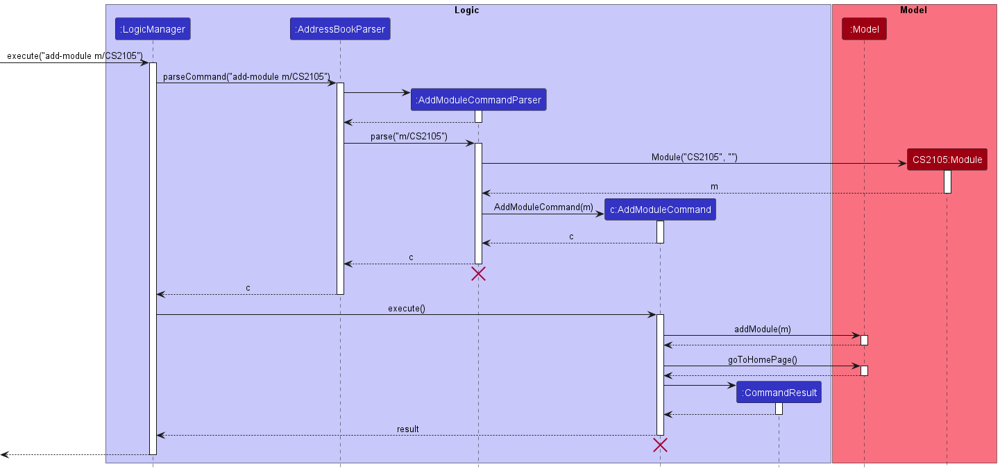

<div markdown="span" class="alert alert-info">:information_source: 
**Note:** The lifeline for `AddModuleCommand` and `AddModuleCommandParser` should end at the 
destroy marker (X) but due to a limitation of PlantUML, the lifeline reaches the end of diagram.
</div>

The following activity diagram summarizes what happens when the user requests to add module to
Plannit via `add-module` command.


#### Alternatives Considered

Aspect: The class-level design of how to integrate the `Module` class to the `Model` component.

* **Alternative 1 (current choice):** Reuse the same `AddressBook` to also store the list of
  unique `Module` objects.

    * Pros: A duplicate class `AddressBook` for `Model` methods is not necessary.

    * Cons: `AddressBook`, `ModelManager` and other classes would need to be updated to include
      `Module`. Hence, the interfaces `ReadOnlyAddressBook` and `Model` also need to be updated to support
      the `Module`-related methods.

* **Alternative 2:** Create another `AddressBook`-like class to store the list of `Module` objects.

    * Pros: Functionality for `Person` and `Module` are now separate. This better adheres to the
      Single Responsibility Principle because `AddressBook` only does operations regarding `Person`
      rather than doing operations regarding both `Person` and `Module`.

    * Cons: More classes to implement. In particular, `AddressBook` and `ReadOnlyAddressBook`
      need to be duplicated into separate classes to support `Module`.

Rationale behind current choice:
1. Duplicating `AddressBook` will result in duplicating dependent classes such as
   `ReadOnlyAddressBook`, `JsonAddressBookStorage` and `JsonSerializableAddressBook`, hence complicating
   the implementation. For example, the storage component will now need to deal with two `AddressBook`
   instances, hence requiring either two separate storage files, or changing the implementation
   to combine the contents of the two different `AddressBook`-like classes into one file. Combining
   `Person` and `Module` into one `AddressBook` would avoid this issue.
2. While dealing with lists of `Person` and `Module` objects are two different functionalities,
   both functionalities deal with a list of user-provided objects. Therefore, the cohesion should not
   significantly decrease.

### Link subcomponent

#### Add link feature

The 'add link' feature allows for the user to add links with corresponding aliases to a `Module` in Plannit.
Links in Plannit are represented by the `Link` class. A `Link` object contains two required fields,
a `String` URL and a `String` alias. For each Plannit `Module`, `Link` objects are stored in a `TreeSet`.

The implementation of the 'delete link' feature is highly similar to this, but without a `String` URL input.

#### Implementation

The add link mechanism is facilitated by `AddLinkCommandParser` and `AddLinkCommand`.
`AddLinkCommandParser` implements the `Parser` interface to validate the `Module` and
pair link URLs with their aliases from the user input.
It then creates a `AddLinkCommand` object with the pairings for the specified `Module`.
`AddLinkCommand` extends the `Command` class to add `Link` objects into a `Module` in Plannit.

Given below is an example usage scenario and how the add link mechanism behaves at each step.

**Step 1**: The user decides to add a link to a current module in Plannit using the following input:
`add-link m/CS1231 l/<link URL> la/<link alias>`.

**Step 2**: The `LogicManager` calls the `LogicManager#execute()` method on the user input.
Then, the `LogicManager` calls the `AddressBookParser#parseCommand()` method
with the user input `String` to create a `Command` object.

**Step 3**: The `AddressBookParser` finds the command keyword `add-link` in the user input.
Thus, a new `AddLinkCommandParser` object is instantiated to parse the arguments from the user input
to create a new `AddLinkCommand` object.

**Step 4**: Within the new `AddLinkCommandParser` object, the `parse` method is used on the arguments to validate
its module code, link URL, and alias. Also, it forms a new `Link` object with its link URL and alias.
A new `AddLinkCommand` is created with the module code and `Link` object, which is returned to `LogicManager`.

**Step 5**: The `AddLinkCommand#execute()` method is then called by the `LogicManager`.
This method will first obtain the `Module` object with the module code indicated by the user.
A copy of the `Module`'s fields is then created and the `Link` object is added to the copied `TreeSet` of links.

**Step 6**: A new `Module` is created with the modified and copied fields, which replaces
the original `Module` object in Plannit using the `Model#setModule()` method.

The following sequence diagram shows how the 'add link' feature works:
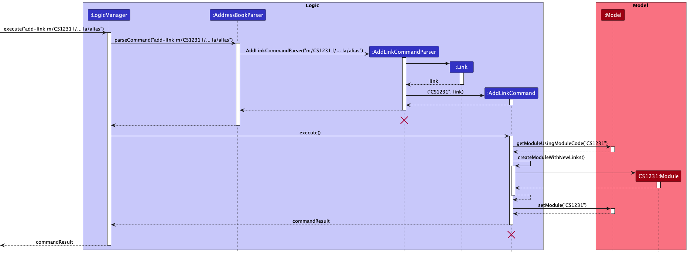
<div markdown="span" class="alert alert-info">:information_source: 
**Note:** The lifeline for `AddLinkCommand` and `AddLinkCommandParser` should end at the destroy marker (X) 
but due to a limitation of PlantUML, the lifeline reaches the end of diagram.
</div>

The following activity diagram shows how the 'add link' feature works:


#### Design considerations:
**Aspect: Link Representation:**
* **Alternative 1 (current choice)**: Link objects require alias and URL.
    * Pros:
        * Fast identification, access, and deletion of links from the user's perspective.
        * Improved sorted display of links (shorter and standardised format).
    * Cons:
        * Longer time for the user to type input.
* **Alternative 2**: Link objects require URL only and its alias is an optional input.
    * Pros:
        * Greater flexibility for different user preferences.
    * Cons:
        * Inconsistent link display format
        * Slow identification, access, and deletion of links from the user's perspective.
* **Alternative 3**: Link objects require URL only and its alias is an optional input with a default alias.
    * Pros:
        * Greater flexibility for different user preferences.
    * Cons:
        * Default alias may be confusing and/or undesirable.
        * Slow identification, access, and deletion of links from the user's perspective.
* **Alternative 4**: Link objects require URL only with no alias.
    * Pros:
        * Easy to implement.
    * Cons:
        * Cluttered and unorganised display of links.
        * Slow identification, access, and deletion of links from the user's perspective.

**Aspect: Link Storage:**
* **Alternative 1 (current choice)**: Link objects stored in a `TreeSet` object within `Module`.
    * Pros:
        * Consistent display order of links in Plannit.
    * Cons:
        * Harder to implement.
* **Alternative 2**: Link objects stored in a `ArrayList` object within `Module`.
    * Pros:
        * Easy to implement.
    * Cons:
        * No standardised display order of links across `Module` objects.
* **Alternative 3**: Link objects stored in a `HashSet` object within `Module`.
    * Pros:
        * Fast performance when accessing and deleting links in terms of time.
    * Cons:
        * Display order of links changes after each modification to the `HashSet` of links for a `Module`.

Rationale behind current choice:

Link Representation: Each link requires an alias and URL such that users are able to make sense of
each URL present in Plannit. By enforcing the user to select their own alias,
they are more likely to remember what each alias means in the long run.
Aliases are also especially useful in differentiating between similar named
URLs, i.e., same domain but the remainder of the url has no semantic meaning to the user (e.g. zoom links).

Link Storage:
TreeSet was selected as to ensure a consistent sorting order across all modules such that users
will spend the least amount of the time searching for their required alias for each module,
thus boosting their productivity.

### Person subcomponent

#### General design
Every contact added into Plannit is represented as a `Person` object.
Every `Person` object has three compulsory attributes:
- `Name`
- `Email`
- `Phone`

The UML class diagram of the `Person`-related parts of the Model component is shown below:


With reference to the diagram above, here are the ways in which different classes in the Model component interact with the `Person` class:
- A `UniquePersonList` object holds all the `Person` objects in Plannit.
    - This `UniquePersonList` object is stored in the `AddressBook` class.
- The `ModelManager` class stores a filtered list of `Person` objects, which is the list used to determine which
  `Person` objects to display on the GUI.

#### Delete Person Feature
One feature related to contacts is the delete person feature, where a contact is deleted from Plannit. This
particular feature is highlighted because its implementation involves additional interactions with the `Module`
component.

#### Implementation of delete person feature
The delete person mechanism is facilitated by `DeletePersonCommand` and `DeletePersonCommandParser`.
`DeletePersonCommandParser` parses the user input in a meaningful way and uses it to create a `DeletePersonCommand`.
`DeletePersonCommand` then calls the `Model#deletePerson()` operation, which in turn calls
`AddressBook#removePerson()` to delete a contact in Plannit.


Given below is an example usage scenario and how the delete person mechanism behaves at each important step.
Before proceeding on with this section, it is highly recommended that you read the
[Module-Person association](#module-and-person-association) section to be able to fully comprehend the example scenario
below.

**Step 1**. There currently exists 3 persons in Plannit, with 2 of them already
added to a module.

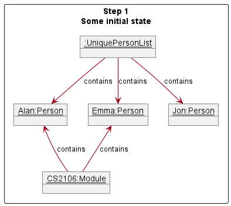

**Step 2**. The user executes `delete-person 2` command and this creates a `deletePersonCommand` to delete the 2nd person
(that is currently displayed on the GUI) in the address book. Upon execution, `UniqueModuleList#removePersonFromModules
()` and `UniquePersonList#remove()` are eventually called. `UniqueModuleList#removePersonFromModules()` removes all
occurrences of the person in every module.


**Step 3**. `UniquePersonList#remove()` removes the person from `UniquePersonList`.
Afterwards, there would no longer be any references to the deleted `Person` object, and Java will eventually remove it
from memory.


The following sequence diagram shows how the delete person operation works.


### Add/Delete Module

#### Implementation

A `Module` class is used to represent a module. A `Module` contains a `ModuleCode` and an
optional `ModuleTitle`. Here are the ways in which different classes in the `Model` component interact
with `Module`:
- A `UniqueModuleList` represents the list of `Module` objects.
- The list of modules is stored in the `AddressBook` class.
- The `ModelManager` class stores the `AddressBook` containing the list of unfiltered `Module`
  objects, and a separate instance variable storing the list of filtered `Module` objects.

The UML class diagram of the `Module`-related parts of `Model` component is shown below:


We have implemented the following `Command` classes:
- `AddModuleCommand` allows the user to add a module to Plannit.
- `DeleteModuleCommand` allows the user to delete a module from Plannit.

The Storage component has been updated for persistent storage of modules. `JsonAdaptedModule`
has been added to represent a `Module` object in JSON format.

Below shows a description of an example scenario for adding a command. Deletion of a command is
similar except that the corresponding deletion class is used instead.

**Step 1**: User enters command `add-module m/CS2105` to add module CS2105 to Plannit.

**Step 2**: `addressBookParser`, the parser for Plannit, will parse the user command to return an
`AddModuleCommand` object.

**Step 3**: The resulting `AddModuleCommand` object is then executed. The validity of the input
module code provided is checked. This involves a check of whether the input is a duplicate module
(case-insensitive, removing leading and trailing whitespaces).

**Step 4**: After successful checks, the module `CS2105` will be added into Plannit.

**Step 5**: The `saveAddressBook()` method of `StorageManager` is called to save the newly-updated list
of modules to a JSON file.

**Step 6**: `JsonAddressBookStorage` is called, which serializes/converts the new list of modules
into JSON format, so that it can be saved into a file. The file will be read whenever Plannit
starts up so that it can load saved module and person data.

**Step 7**: Plannit Graphical User Interface (GUI) displays message that the addition of module has
been successful.

The following activity diagram summarizes what happens when the user requests to add module to
Plannit via `add-module` command.


#### Alternatives Considered

Aspect: The class-level design of how to integrate the `Module` class to the `Model` component.

* **Alternative 1 (current choice):** Reuse the same `AddressBook` to also store the list of
  unique `Module` objects.

    * Pros: A duplicate class `AddressBook` for `Model` methods is not necessary.

    * Cons: `AddressBook`, `ModelManager` and other classes would need to be updated to include
      `Module`. Hence, the interfaces `ReadOnlyAddressBook` and `Model` also need to be updated to support
      the `Module`-related methods.

* **Alternative 2:** Create another `AddressBook`-like class to store the list of `Module` objects.

    * Pros: Functionality for `Person` and `Module` are now separate. This better adheres to the
      Single Responsibility Principle because `AddressBook` only does operations regarding `Person`
      rather than doing operations regarding both `Person` and `Module`.

    * Cons: More classes to implement. In particular, `AddressBook` and `ReadOnlyAddressBook`
      need to be duplicated into separate classes to support `Module`.

Rationale behind current choice:
1. Duplicating `AddressBook` will result in duplicating dependent classes such as
   `ReadOnlyAddressBook`, `JsonAddressBookStorage` and `JsonSerializableAddressBook`, hence complicating
   the implementation. For example, the storage component will now need to deal with two `AddressBook`
   instances, hence requiring either two separate storage files, or changing the implementation
   to combine the contents of the two different `AddressBook`-like classes into one file. Combining
   `Person` and `Module` into one `AddressBook` would avoid this issue.
2. While dealing with lists of `Person` and `Module` objects are two different functionalities,
   both functionalities deal with a list of user-provided objects. Therefore, the cohesion should not
   significantly decrease.

### Module and Person association

A person can take several modules. To model this interaction, every person in Plannit thus has the ability to be
associated to a module. The relationship between `Person` and `Model` is displayed in the Object Oriented Domain Model diagram below:


#### Add Person To Module Feature
One feature related to the module-person association is the add person to module feature. The feature allows an already
existing contact in Plannit to have an association with a module. This particular feature is highlighted because it is
an implementation that involves interactions between two different kinds of `Model` objects, namely `Person` and
`Module`. Note that the implementation of this feature is largely similar to the other feature under this section,
namely the delete person from module feature.

#### Implementation of add person to module feature
The add person to module mechanism is facilitated by `AddPersonToModuleCommand` and `AddPersonToModuleCommandParser`.
`AddPersonToModuleCommandParser` parses the user input in a meaningful way and uses it to create a `AddPersonToModuleCommand`.
`AddPersonToModuleCommand` then calls the `Model#getModuleUsingModuleCode()` and `Model#getPersonUsingName()` operations
to obtain the concerned module and person instances. Note that the specified instances must be in the currently filtered
display lists, else an exception is thrown. The obtained module instance is then copied over and used to construct a
new module object. Finally, the person instance of concern is added to the newly created module object, and we then replace
the old module object in `UniqueModuleList` with the new module object.


Given below is an example usage scenario and how the add person to module mechanism behaves at each important step.

**Step 1**. There currently exists 2 persons (Alan and Emma) in Plannit, and the user wants to add an association
between Alan and the module CS2106.

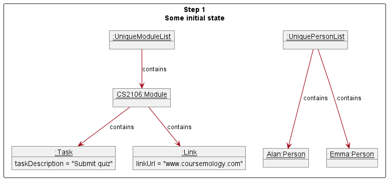

**Step 2**. The user executes `add-person-to-module m/CS2106 n/Alan` command and this creates a
`addPersonToModuleCommand`. Upon execution, `Model#getModuleUsingModuleCode()` and `Model#getPersonUsingName()` are used
to obtain the existing CS2106 module and Alan person instances. `AddPersonToModuleCommand#createModuleWithAddedPerson()`
is then called to create a new CS2106 module instance by copying all fields of the old CS2106 instance and also adding
the Alan person instance in.

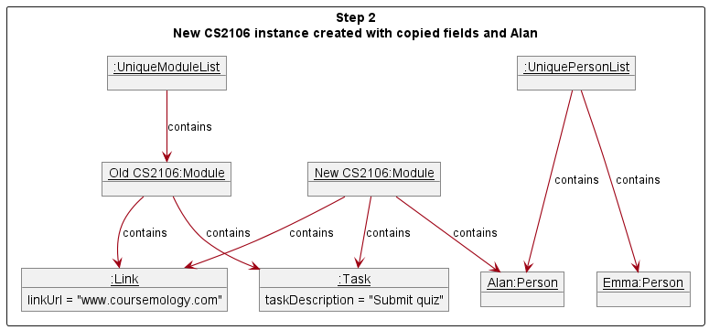

**Step 3**. `Model#setModule()` replaces the old CS2106 instance with the new CS2106 instance in `UniqueModuleList`.
Afterwards, there would no longer be any references to the old CS2106 object, and Java will eventually remove it
from memory.

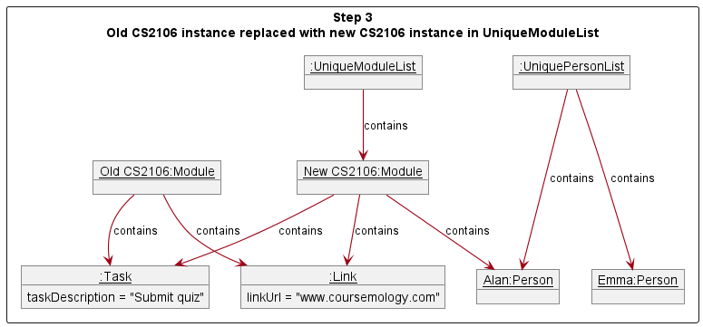

#### Design considerations:
**Aspect: Implementation direction:**

* **Alternative 1 (current choice)**: Store `Person` as a `Set` field in `Module`.
    * Pros: No need for extra classes, making it easier to implement.
    * Cons: Does not fully model the bidirectional relationship that a module has with a person.

* **Alternative 2:** Store `Person` as a `Set` field in `Module` and at the same time, store `Module` as a `Set` field
  in `Person`
    * Pros: The bidirectional relationship is fully reflected in code.
    * Cons: Harder to implement as deleting a module object now requires deletion of that module in every person's set
      of modules as well.

* **Alternative 3:** Have an association class that models the "person is taking module" association.
    * Pros: The dependencies of the `Module` and `Person` class does not increase as no direct reference to the other type
      is now required.
    * Cons: Harder to implement as this requires creation of new classes and many more test cases.

Rationale behind current choice:
1. Despite the benefit of having code that fully reflects the relationship in the real world, going for a simpler
   implementation helps to reduce code complexity and lowers risk of bugs.
2. Despite the benefit of having lower dependencies, the use of an association class substantially increases the risk of
   bugs as the implementation would be very different from existing (heavily-tested) code.


### Task subcomponent

#### Implementation

A `Task` class is used to represent a task that is to be completed by the
user. Tasks are assigned to a specific module. The following `Command`
classes were implemented to allow users to interact with `Task` objects:
- `AddTaskCommand` allows the user to add a task to a specified `Module` in
  Plannit.
- `DeleteTaskCommand` allows the user to delete a task from a specified
  `Module` in Plannit.
- `SwapTaskCommand` allows the user to swap the order of `Task`s within a
  specified `Module` in Plannit.

Each `Module` within the `UniqueModuleList` stores a `TaskList`
instance, which in turn stores a list of `Task` objects. This `TaskList`
object is used to maintain the list of `Task` objects within the module by
supporting operations to add, delete and swap tasks.


<div markdown="span" class="alert alert-info">:information_source: 
**Note:**  All `Module` objects are instantiated with an empty `TaskList`.
</div>

Similar to `UniqueModuleList` and `UniquePersonList`, a `TaskList` contains the following:
* `internaList` - An `ObservableList<>` containing the tasks
  of a module. This list is used for the adding and removing of objects in
  the data structure.
* `internaUnmodifiableList` - An `ObservableList<>` that is
  an **unmodifiable** copy of `internalList`. This list is used when external
  objects requests a copy of the current list of objects.

However, there exists two key differences:
1. `TaskList` is used to store `Task` objects as opposed to the storage of
   `Module` in `UniqueModuleList` and `Person` in `UniquePersonList`
   respectively.
2. A different `TaskList` instance exists in each `Module` object, meaning
   multiple instances of the `TaskList` object can exist within an
   `AddressBook` instance. On the other hand, there will always be only one
   `UniqueModuleList` instance and one `UniquePersonList` instance in the
   `AddressBook` instance.

Here's a (partial) object diagram of an `AddressBook` instance to
demonstrate the above point:

<div markdown="span" class="alert alert-info">:information_source: **Note:** 
There is only one instance of `UniquePersonList` (in purple) and 
`UniqueModuleList` (in blue). However, there are two instances of `TaskList`
(in orange), corresponding to the number of modules.
</div>

Given below is an example usage scenario and how the mechanism
behaves when a user adds a new `Task` with the `add-task` command. The behavior
for the deleting and swapping of tasks is highly similar.

**Step 1**. The user requests to add a task into a module present in Plannit by
inputting the `add-task` command followed by the `m/` flag to indicate the
module code argument and the `td/` flag indicate the task description argument.
<br>
E.g.:
```
add-task m/CS1231 td/Submit the weekly assignment
```

**Step 2**: The `LogicManager` uses the `AddressBookParser`  and
`AddTaskCommandParser` to parse the user input. After validating the
arguments provided by the user, the `ModuleCode` of the module to add the
task to and the task description of the new task is extracted by the `AddTaskCommandParser`.

**Step 3**: An `AddTaskToModuleDescriptor` object is then instantiated to
contain the extracted `ModuleCode` and a new `Task` with the extracted task
description.

**Step 4**: This `AddTaskToModuleDescriptor` is used to instantiate an
`AddTaskCommand` object that is returned to the `LogicManager`.

**Step 5**: The `AddTaskCommand#execute()` method is then called by the
`LogicManager`. This method will first obtain the `Module` with the
`ModuleCode` indicated by the user by calling `Model#getModule()`. A copy of
the `Module`'s fields are then created.

**Step 6**: A new `Task` is then added to the copied `TaskList` field.

**Step 7**: A new `Module` is then created using the copied fields along
with the updated `TaskList` field.

**Step 8**: The `Module` currently existing in the `Model` is then
replaced with this new updated `Module` using the `Model#setModule()` method.

The following sequence diagram summarizes what happens when a user executes
the `add-task` command:

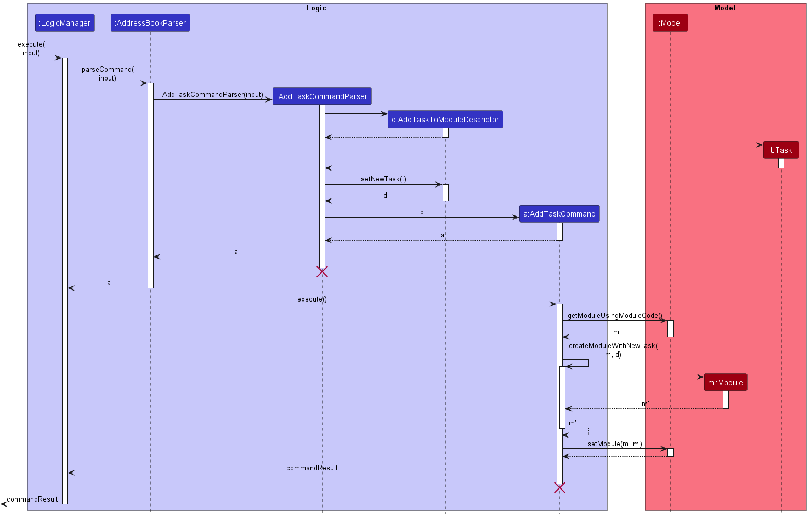
<div markdown="span" class="alert alert-info">:information_source: 
**Note:** The lifeline for `AddTaskCommand`,  and `AddTaskCommandParser` should 
end at the destroy marker (X) but due to a limitation of PlantUML, the lifeline reaches the end of diagram.
</div>

#### Design considerations:
**Aspect: Data structure to store `Task`:**

* **Alternative 1 (current choice): Define a new `TaskList` class**
    * Pros: Methods handling the adding, deleting and maintaining of `Task`s
      can be abstracted away into the `TaskList`.
    * Cons: Additional complexities brought about by implementing a new class.

* **Alternative 2:** Store `Task` as an `ArrayList` field in `Module`.
    * Pros: `Module` can directly handle the adding, deleting and
      maintaining of its `Task`s.
    * Cons: Poor adherence to [SOLID](https://nus-cs2103-ay2223s1.github.io/website/se-book-adapted/chapters/principles.html#solid-principles)
      design principles.

Rationale behind current choice:
1. Despite the additional complexities, it is good practice to adhere with the
   SOLID design principles.
2. Furthermore, the additional complexities and potential for new bugs can
   be mitigated by robust unit and integration testing.

**Aspect: Manner of handing arguments to `AddTaskCommand` constructor:**

* **Alternative 1 (current choice):** Pass arguments as a single
  `AddTaskToModuleDescriptor` object.
    * Pros: Neater to store all arguments in a single data structure.
      Will be highly beneficial when more fields are added to a `Task`
      in the future.
    * Cons: Additional complexities brought about by implementing a new class.

* **Alternative 2:** Pass arguments directly into the `AddTaskCommand`
  constructor
    * Pros: Simpler to implement.
    * Cons: Number of arguments taken in by the constructor will
      increase when more fields are added to a `Task` in the future.

Rationale behind current choice:

1. Despite the additional complexities, a `Task` object is likely to have
   additional fields (e.g. `Date`, `Priority`) in future iterations. Should we
   pass fields directly in to the constructor as arguments, the number of
   parameters in the constructor would increase. This would greatly affect the
   readability of the code.
2. The additional complexities and potential for new bugs can be mitigated
   by robust unit and integration testing.

### Search and Navigation

#### Find module feature
<div markdown="span" class="alert alert-info">:information_source: **Note:**
Find person feature is similar and will be omitted.
</div>

##### Implementation

Find module mechanism is facilitated by the `FindModuleCommand` and `FindModuleCommandParser`.

It allows users to obtain a list of modules starting with the keyword provided.<br>

It uses the following methods provided by the `Model` interface.
* `Model#updateFilteredModuleList()`: Update the current module list and filter it according to the given predicate `Predicate<Module> predicate`, reflecting the changes accordingly in the GUI
* `Model#getHomeStatusAsBoolean()`: obtains the home status of Plannit.

Given below is an example usage scenario and how the mechanism
behaves when a user searches for modules in Plannit.

**Step 1**. The user requests to search for a module in the Plannit by
inputting the `find-module` command followed by a keyword.
E.g.:
```
find-module CS
```

**Step 2**: The `LogicManager` uses the `AddressBookParser` and `FindModuleCommandParser`
to parse the user input. After validating the arguments provided by the user, the user input
is used to instantiate a `ModuleCodeStartsWithKeywordPredicate` object.

**Step 3**: A `FindModuleCommand` object is instantiated using the `ModuleCodeStartsWithKeywordPredicate`
obtained in **Step 2** which is returned to the `LogicManager`.

**Step 4**: `LogicManager` calls the `FindModuleCommand#execute()` method. This method will first
obtain the home status of Plannit by calling `Model#getHomeStatusAsBoolean()` and check if Plannit
is currently at home.

**Step 5**: The module list is then filtered using the `Model#updateFilteredModuleList()` method according
to the `ModuleCodeStartsWithKeywordPredicate` object instantiated in **Step 2**.

**Step 6**: A new `CommandResult` object is returned, indicating success.

The following sequence diagram summarizes what happens when a user executes the `find-module` command:

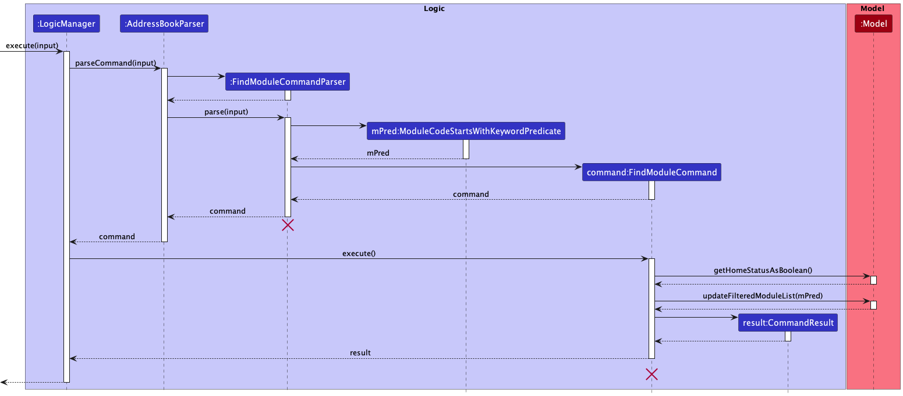

<div markdown="span" class="alert alert-info">:information_source: **Note:** The lifeline for `FindModuleCommandParser`
and `FindModuleCommand` should end at the destroy marker (X) but due to a limitation of PlantUML, the lifeline reaches
the end of diagram.
</div>

<div style="page-break-after: always;"></div>

The following activity diagram summarizes what happens when a user executes a `FindModuleCommand`:

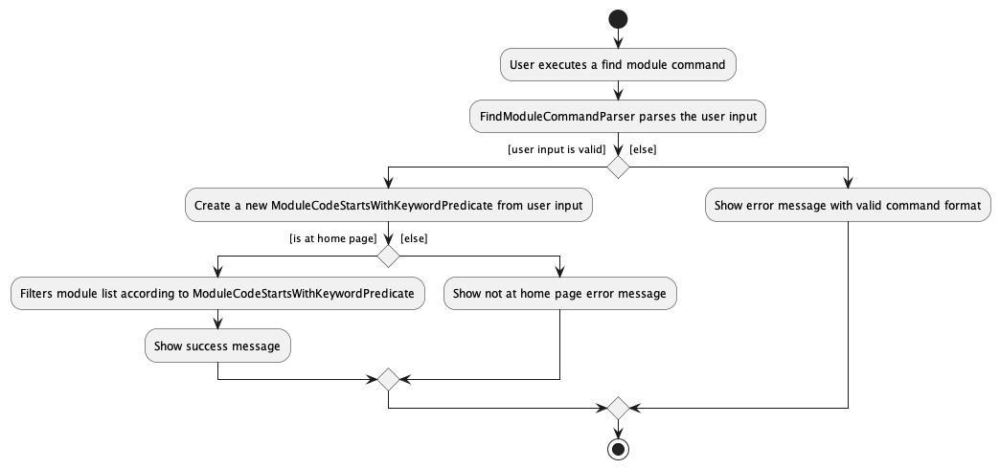

#### List module feature
<div markdown="span" class="alert alert-info">:information_source: **Note:**
List person feature is similar and will be omitted.
</div>

##### Implementation

List module mechanism is facilitated by the `ListModuleCommand`.

It allows users to obtain a list of every module in Plannit.<br>

It uses the following methods provided by the `Model` interface.
* `Model#updateFilteredModuleList()`: Update the current module list and filter it according to the given predicate `Predicate<Module> predicate`, reflecting the changes accordingly in the GUI
* `Model#getHomeStatusAsBoolean()`: obtains the home status of Plannit.

Given below is an example usage scenario and how the mechanism
behaves when a user list all modules in Plannit.

**Step 1**. The user requests to list all modules in Plannit by
inputting the `list-module` command.
E.g.:
```
list-module CS
```

**Step 2**: The `LogicManager` uses the `AddressBookParser` to parse the user input.
After validating the arguments provided by the user, the user input is used to instantiate
a `ListModuleCommand` object, which is returned to the `LogicManger`.

**Step 3**: `LogicManager` calls the `ListModuleCommand#execute()` method. This method will first
obtain the home status of Plannit by calling `Model#getHomeStatusAsBoolean()` and check if Plannit
is currently at home.

**Step 4**: The module list is then filtered using the `Model#updateFilteredModuleList()` method according
to the `Model#PREDICATE_SHOW_ALL_MODULES` predicate.

**Step 5**: A new `CommandResult` object is returned, indicating success.

The following sequence diagram summarizes what happens when a user executes the `list-module` command:

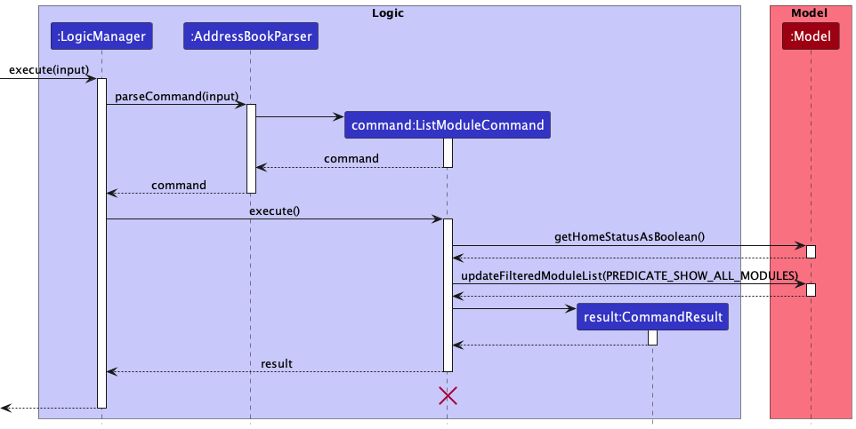

<div markdown="span" class="alert alert-info">:information_source: **Note:** The lifeline for `ListModuleCommand` should
end at the destroy marker (X) but due to a limitation of PlantUML, the lifeline reaches the end of diagram.
</div>

<div style="page-break-after: always;"></div>

The following activity diagram summarizes what happens when a user executes a `ListModuleCommand`:

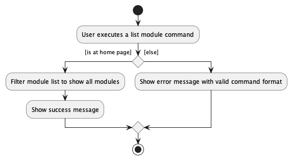

#### Navigate to module feature

##### Implementation

Navigate to module mechanism is facilitated by the `GoToCommand` and `GoToCommandParser`.

It allows users to navigate to a specific module given their respective module code, displaying information
(i.e. tasks, links and persons) that are associated to that module.<br>

It uses the following methods provided by the `Model` interface.
* `Model#getModuleUsingModuleCode()`: Retrieves a `Module` object using the `ModuleCode` object associated with that `Module`
* `Model#updateFilteredModuleList()`: Update the current module list and filter it according to the given predicate `Predicate<Module> predicate`, reflecting the changes accordingly in the GUI
* `Model#updateFilteredPersonList()`: Update the current person list and filter it according to the given predicate `Predicate<Person> predicate`, reflecting the changes accordingly in the GUI
* `Model#setHomeStatus()`: Sets the home status of Plannit.

Given below is an example usage scenario and how the mechanism
behaves when a user navigates to a module in Plannit.

**Step 1**. The user requests to navigate to a module present in the Plannit
by inputting the `goto` command followed by the module code of the module.
E.g.:
```
goto CS1231
```

**Step 2**: The `LogicManager` uses the `AddressBookParser` and `GoToCommandParser`
to parse the user input. After validating the arguments provided by the user, the user input
is used to perform the following actions: <br>
* Extract the `ModuleCode` of the module to navigate to in the `GoToCommandParser` using the method `ParserUtil#parseModuleCode()`
* Instantiate a `ModuleCodeMatchesKeywordPredicate` object

**Step 3**: A `GoToCommand` object is instantiated using the `ModuleCodeMatchesKeywordPredicate` and `ModuleCode`
obtained in **Step 2** which is returned to the `LogicManager`.

**Step 4**: `LogicManager` calls the `GoToCommand#execute()` method. This method will first
obtain the `Module` associated with the `ModuleCode` obtained in **Step 2** by calling
`Model#getModuleUsingModuleCode()`.

**Step 5**: The module list is then filtered using the `Model#updateFilteredModuleList()` method according
to the `ModuleCodeMatchesKeywordPredicate` object instantiated in **Step 2**.

**Step 6**: A `PersonIsInModulePredicate` object is then instantiated with the `Module` object <br>
obtained in **Step 4**.

**Step 7**: The person list is then filtered using the `Model#updateFilteredPersonList()` method according
to the `PersonIsInModulePredicate` object instantiated in **Step 6**.

**Step 8**: The home status of Plannit is set to false via `Model#SetHomeStatus()`.

**Step 9**: A new `CommandResult` object is returned, indicating success.

The following sequence diagram summarizes what happens when a user executes the `goto` command:

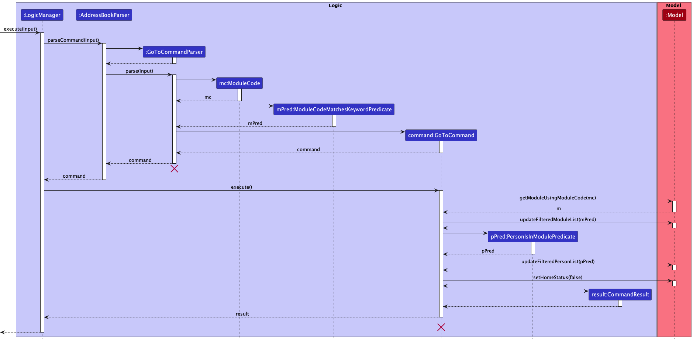

<div markdown="span" class="alert alert-info">:information_source: **Note:** The lifeline for `GoToCommandParser`
and `GoToCommand` should end at the destroy marker (X) but due to a limitation of PlantUML, the lifeline reaches
the end of diagram.
</div>

<div style="page-break-after: always;"></div>

The following activity diagram summarizes what happens when a user executes a `GoToCommand`:

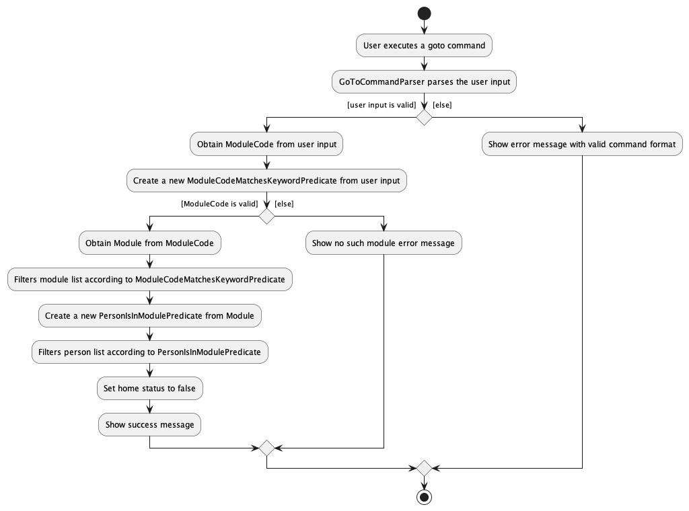

#### Navigate to home feature

##### Implementation

Navigate to home mechanism is facilitated by the `HomeCommand`.

It navigates users back to the home page of Plannit, showing all modules and persons stored in Plannit.<br>

It uses the following methods provided by the `Model` interface.
* `Model#goToHomePage()`: Sets home status to true and update module list and person list to show all modules and persons respectively, reflecting the changes accordingly in the GUI

Given below is an example usage scenario and how the mechanism
behaves when a user navigates back to the home page of Plannit.

**Step 1**. The user requests to go home by inputting the `home` command.
E.g.:
```
home
```

**Step 2**: The `LogicManager` uses the `AddressBookParser` to instantiate
a `HomeCommand` object, which is returned to the `LogicManger`.

**Step 3**: `LogicManager` calls the `HomeCommand#execute()` method. This method will then
call the `Model#goToHomePage()` method which perform the following actions:
* Set home status to true
* Update module list to show all modules
* Update person list to show all persons

**Step 5**: A new `CommandResult` object is returned, indicating success.

The following sequence diagram summarizes what happens when a user executes the `home` command:

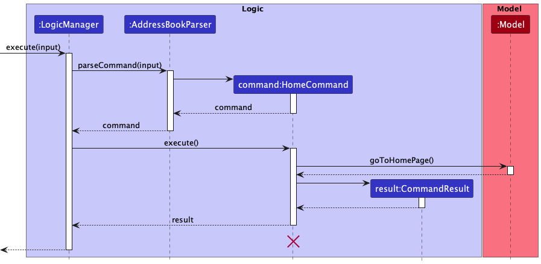

<div markdown="span" class="alert alert-info">:information_source: **Note:** The lifeline for `HomeCommand`should end
at the destroy marker (X) but due to a limitation of PlantUML, the lifeline reaches the end of diagram.
</div>

#### Design consideration:

##### Aspect: How `goto` executes

* **Alternative 1 (current choice):** Navigate to a single module by module code and update home status.
    * Pros:
        * Provides an intuitive and more versatile way for users to navigate between modules.
        * Provides an intuitive usage of commands by limiting the scope of possible commands usable
          when out of the home page.
    * Cons: Unable to search for multiple persons with different attributes.

* **Alternative 2:** Navigate to a single module by module code.
    * Pros: Provides an intuitive and more versatile way for users to navigate between modules.
    * Cons: Might result in confusion when some commands are usable out of the home page.

* **Alternative 3:** Navigate to module by index.
    * Pros: Allows for quicker input as compared to typing out the entire module code
    * Cons: Require user to navigate back to home page before going to another module which might be unintuitive for users.

##### Rationale behind current choice:
1. Alternative 1 was chosen as it provides a more intuitive way for prospective users.

2. The following commands `list-module` and `find-module` are disabled as they are not meant to be used in tandem with `goto` command
   as the filtering of modules is not needed when there exist only one module.

3. The following commands `list-person` and `find-person` are disabled as they are not meant to be used in tandem with `goto` command
   as essential persons within a module (i.e. professors, tutor assistant and friends) are likely to be limited in numbers.

Hence, to prevent confusion we chose Alternative 1.

<div style="page-break-after: always;"></div>

--------------------------------------------------------------------------------------------------------------------

## **Documentation, logging, testing, configuration, dev-ops**

* [Documentation guide](Documentation.md)
* [Testing guide](Testing.md)
* [Logging guide](Logging.md)
* [Configuration guide](Configuration.md)
* [DevOps guide](DevOps.md)

--------------------------------------------------------------------------------------------------------------------

## **Appendix: Requirements**

### Product scope

**Target user profile**:

* Tech-Savvy NUS Student
* Reasonably fast typer
* Comfortable using CLI apps
* Forgets which friends have common modules with him
* Takes a lot of modules
* Takes modules where information are spread over multiple websites
* Tends to work at night

**Value proposition**:

**Plannit** is an **all-in-one application** that streamlines the execution of module
deliverables by **empowering NUS students** with the ability to manage **tasks**, **links** and
**module-mates** (i.e., students in the same module) to increase their productivity.


### User stories

Priorities: `High` (must have), `Medium` (nice to have), `Low` (unlikely to have)

| Priority | As a …             | I want to …                                     | So that I can…                                                                                        |
|----------|--------------------|-------------------------------------------------|-------------------------------------------------------------------------------------------------------|
| `High`   | User               | Add a contact                                   | View them in future settings                                                                          |
| `High`   | User               | Delete a contact                                | Trim my contact list to keep it updated                                                               |
| `High`   | User               | Add a module into Plannit                       | Add details of the module                                                                             |
| `High`   | User               | Delete a module into Plannit                    | Remove unnecessary modules after the semester ends                                                    |
| `High`   | User               | Add tasks for each module into Plannit          | Keep track of tasks for each module                                                                   |
| `High`   | User               | Delete tasks from module on Plannit             | Remove tasks that have been completed                                                                 |
| `High`   | User               | Add links                                       | Store module-related links for future access                                                          | 
| `High`   | User               | Open links                                      | Access module-related links                                                                           | 
| `High`   | User               | Delete links                                    | Remove module-related links when the semester ends                                                    |
| `High`   | User               | Easily navigate through different modules       | Quickly view relevant modules details                                                                 |
| `High`   | Busy User          | See the overview of tasks on the home page      | Get a quick summary of upcoming tasks                                                                 |
| `Medium` | User               | Edit module details                             | Rectify mistakes and update module details when needed                                                |
| `Medium` | User               | Edit a contact                                  | Rectify mistakes and update contact details when needed                                               |
| `Medium` | User               | Set different priorities to prioritise my tasks | I know is important and should be done first                                                          |
| `Medium` | Forgetful Student  | Organise contacts by module                     | I can discuss difficult assignment questions with them and delete them once the semester is completed |
| `Medium` | Organised Person   | Filter contacts by names                        | Search for contacts relevant for my case                                                              |
| `Medium` | Expert User        | Search a keyword	                               | Go to the module which has the relevant topic I have in mind                                          |
| `Medium` | User               | Detect (and delete) duplicate items             | Avoid adding a same item twice                                                                        |
| `Medium` | New potential user | See the app populated with sample data          | Easily see how the app will look like when it is in use                                               |
| `Medium` | Forgetful student  | Group contacts by tags	                         | Find out which friends are taking what modules                                                        |
| `Medium` | Expert User        | Purge existing module data                      | Save time deleting all the module data when the semester ends                                         |
| `Low`    | Expert User        | Archive existing data                           | Restore the data in case I mess up                                                                    |

### Use cases

(For all use cases below, the **System** is the Plannit application and the **Actor** is the user, unless specified otherwise)

#### Use case: UC01 - Add a module
**Main Success Scenario (MSS)**
1. User requests to add module.
2. Plannit adds the module.
3. Plannit displays to the user that the module addition is successful.

Use case ends

**Extensions**
* 1a. The module already exists.
    * 1a1. Plannit displays an error message.

  Use case ends

#### Use case: UC02 - Delete a module
**Main Success Scenario (MSS)**
1.  User requests to list modules.
2.  Plannit displays a list of modules.
3.  User requests to delete a specific module in the list.
4.  Plannit deletes the module.

Use case ends.

**Extensions**

* 1a. The list is empty.

  Use case ends.

* 3a. The given index is invalid.

    * 3a1. Plannit displays an error message.

  Use case resumes at step 2.

#### Use case: UC03 - Find module
**Preconditions**:
* User is on the home page.

**Main Success Scenario (MSS)**
1. User chooses to search up on modules with module code starting with specific keyword.
2. Plannit requests for keyword.
3. User enters the keyword.
4. Plannit searches and displays a list of modules with module code starting with the specified keyword.

Use case ends.

#### Use case: UC04 - List module
**Preconditions**:
* User is on the home page.

**Main Success Scenario (MSS)**
1. User chooses to obtain every module in Plannit.
2. Plannit returns a list with every module in Plannit.

Use case ends.

#### Use case: UC05 - Find person
**Preconditions**:
* User is on the home page.

**Main Success Scenario (MSS)**
1. User chooses to search up on person with names starting with specific keyword.
2. Plannit requests for keyword.
3. User enters the keyword.
4. Plannit searches and displays a list of persons with names starting with the specified keyword.

Use case ends.

#### Use case: UC06 - List person
**Preconditions**:
* User is on the home page.

**Main Success Scenario (MSS)**
1. User chooses to obtain every person in Plannit.
2. Plannit returns a list with every person in Plannit.

Use case ends.

#### Use case: UC07 - Add a task
**Preconditions**:
* User has completed [UC01](#use-case-uc01---add-a-module).
* Module list is not empty.

**Main Success Scenario (MSS)**
1.  User requests to add a task to a specific module in the list.
2.  Plannit adds the task to the module.

    Use case ends.

**Extensions**
* 1a. The given module is invalid.

    * 1a1. Plannit displays an error message.

  Use case ends.

* 1b. The given task is in an invalid format.

    * 1b1. Plannit displays an error message.

  Use case ends.

#### Use case: UC08 - Delete a task
**Preconditions**:
* User has completed [UC01](#use-case-uc01---add-a-module).
* Module list is not empty.
* Task list of module is not empty.

**Main Success Scenario (MSS)**
1.  User requests to delete a specific task from a module in the list.
2.  Plannit deletes the task from the module.

Use case ends.

**Extensions**
* 1a. The given module is invalid.

    * 1a1. Plannit displays an error message.

  Use case ends.

* 1b. The given task number is invalid.

    * 1b1. Plannit displays an error message.

  Use case ends.

#### Use case: UC09 - Swap task
**Precondition**
* User has completed [UC01](#use-case-uc01---add-a-module).
* Module list is not empty.
* Task list of module has at least two tasks.

**Main Success Scenario (MSS)**
1. User requests to swap the order of two tasks belonging to a module in the
   list.
2. Plannit displays to the user the list of tasks with the order of the two
   tasks swapped.

**Extensions**
* 1a. The given module is invalid.

    * 1a1. Plannit displays an error message.

  Use case ends.

* 1b. The given task number is invalid.

    * 1b1. Plannit displays an error message.

  Use case ends.

#### Use case: UC10 - Add a Module Link
**Preconditions**:
* User has completed [UC01](#use-case-uc01---add-a-module).
* Module list is not empty.

**Main Success Scenario (MSS)**
1. User requests for the addition of a module-specific link.
2. Plannit adds and associates the entered link to the specific module.

Use case ends.

Extension:
* 1a. Plannit detects the module does not exist.
    * 1a1. Plannit displays an error message.

  Use case ends.

* 1b. Plannit detects the link is already added.
    * 1b1. Plannit displays an error message.

  Use case ends.

#### Use case: UC11 - Delete a Module Link
**Main Success Scenario (MSS)**
1. User requests for the deletion of a module-specific link.
2. Plannit deletes the entered link from the specific module.

Use case ends.

Extension:
* 1a. Plannit detects the module does not exist.
    * 1a1 Plannit displays an error message.

  Use case ends.

* 1b. Plannit detects the link does not exist.
    * 1b1 Plannit displays an error message.

  Use case ends.

#### Use case: UC12 - Add a contact
**Main Success Scenario (MSS)**
1.  User chooses to add a contact.
2.  Plannit requests for the to-be-added contact detail.
3.  User enters the to-be-added contact details.
4.  Plannit adds the contact and notifies the user that the contact has been successfully added.

Use case ends.

**Extensions**
* 3a. The contact is duplicate, i.e. name already exists.
    * 3a1. Plannit displays an error message notifying the user that a
      duplicate contact exists.

  Use case ends.

* 3b. The email address is invalid.
    * 3b1. Plannit displays an error message notifying the user that the
      email address is invalid.

  Use case ends.

* 3c. The phone number is invalid.
    * 3c1. Plannit displays an error message notifying the user that the phone
      number is invalid.

  Use case ends.

#### Use case: UC13 - Delete a contact
**Main Success Scenario (MSS)**
1. User chooses to delete a contact.
2. Plannit requests for the name of the contact.
3. User enters the contact's name.
4. Plannit searches for the contact and notifies user that the contact has been
   deleted.

Use case ends.

Extensions:
* 3a. Plannit detects that the specified contact does not exist.
    * 3a1. Plannit displays a text, informing that the specified contact does not exist.

  Use case ends.

#### Use case: UC14 - Find contact
**Main Success Scenario (MSS)**
1. User chooses to search up his friend's email.
2. Plannit requests for name of friend.
3. User enters the friend's name.
4. Plannit searches for the name and displays the friend's details.

Use case ends.

Extensions:
* 3a. Plannit detects that the specified contact does not exist.
    * 3a1. Plannit displays a text, informing that the specified contact does not exist.

  Use case ends.

#### Use case: UC15 - Navigate to Home Page
**Main Success Scenario (MSS)**
1.  User requests to navigate to Home Page.
2.  Plannit displays the Home Page.

Use case ends.

**Extensions**

* 1a. Already at Home Page.

  Use case ends.

#### Use case: UC16 - Navigate to Module
**Main Success Scenario (MSS)**
1. User requests to navigate to a specific module.
2. Plannit requests for the module code of the specific module.
3. User enters the module code.
4. Plannit displays the module details.

Use case ends.

**Extensions**

* 1a. Module with given module code does not exist.

    * 1a1. Plannit displays an error message.

  Use case ends.

#### Use case: UC17 - Exit program
**Main Success Scenario (MSS)**
1.  User requests to exit program.
2.  Plannit closes program.

Use case ends.


### Non-Functional Requirements

#### Constraints
1. Plannit cannot use NUS API to scrap data from LumiNUS/Canvas.
2. Plannit should run independently of remote servers.
3. Plannit cannot use a relational database management system.
4. Plannit executable size should be smaller than 100MB.

#### Technical Environment
1. Should work on any _mainstream OS_ as long as it has Java `11` or above installed.
2. Plannit should work on 64-bit environments.
3. The GUI should:
    * _work well_ for standard screen resolutions 1920x1080 and higher, and for screen scales 100% and 125%.
    * be _usable_ for screen resolutions 1280x720 and higher, and for screen scales 150%.
4. Plannit is packaged into one `JAR` file.
5. The software should work without an installer.
6. Plannit should work without an internet connection.

#### Performance
1. Plannit should be able to hold up to 1000 _entries_ without a noticeable sluggishness in performance for typical usage.
2. Plannit should be able to save and load up to 1000 _entries_ without a noticeable delay in performance.
3. Plannit should respond to any user requests within 2 seconds as long as there are less than 1000 entries.

#### Quality
1. Plannit should be usable by someone with better-than-average typing speed.
2. Plannit should be beginner-friendly and easily picked up by new users.
3. Font size should be of reasonable size.
4. The colours of the application should not induce eye strain.

#### Process
1. Development of Plannit should adhere to the following deadlines:
    * **v1.1**: 28 September 2022 (Week 7, Wednesday)
    * **v1.2**: 12 October 2022 (Week 9, Wednesday)
    * **v1.3**: 26 October 2022 (Week 11, Wednesday)
    * **v1.4**: 07 November 2022 (Week 13, Monday)
2. The team should meet every Saturday at 9pm until the end of the project.
3. Each team member should follow the forking workflow.
4. At least 2 members need to approve a pull request before it can be successfully merged into the master branch on `GitHub`.
5. Plannit's implementation should follow Object-Oriented Programming paradigm primarily.

#### Project Scope
1. Plannit does not automatically update module details/links.
2. Plannit does not rigorously check for the validity of the email provided by the user.
3. Plannit does not verify the existence or security of links provided by the user
4. Plannit does not rigorously check for the validity of links provided by the user.
5. Plannit does not rigorously check for the existence of phone number provided by the user.
6. Plannit does not remind the user of upcoming tasks with notifications.
7. Plannit does not check for invalid module codes.

#### Other noteworthy points
1. Plannit's code should be easily testable.

### Glossary
* **Entries**: Modules, Contacts, Links, Tasks
* **Mainstream OS**: Windows, Linux, Unix, macOS
* **Usable**: All functions can be used even if the user experience is not optimal
* **Work well**: Should not cause any resolution-related inconveniences to the user

--------------------------------------------------------------------------------------------------------------------

## **Appendix: Instructions for manual testing**

Given below are instructions to test the app manually.

<div markdown="span" class="alert alert-info">:information_source: **Note:** These instructions only provide a starting point for testers to work on;
testers are expected to do more *exploratory* testing.

</div>

<!-- @@author cheeheng -->
Assumption: The sample data is loaded into Plannit.

<div markdown="span" class="alert alert-info">:information_source: **Note:**
Sample data is automatically loaded into Plannit when <code>data/addressbook.json</code> is not found. 

To load the sample data, close Plannit (if a Plannit instance is active) and delete `data/addressbook.json` if it exists.
Remember to perform a backup before deletion if necessary. Then, open Plannit.

</div>

<!-- @@author ekweirui -->
### Launching the application

1. Initial launch

    1. Download the `JAR` file and copy it into an empty folder

    2. Double-click the `JAR` file or run `java -jar plannit.jar` using the terminal.
       Expected:
        * Shows the GUI with a set of sample contacts.
        * The window size may not be optimum.

2. Saving window preferences

    1. Resize the window to an optimum size. Move the window to a different location. Close the window.

    2. Re-launch the app by double-clicking the `JAR` file.<br>
       Expected:
        * The most recent window size and location is retained.

<!-- @@author cheeheng -->
### Adding a module
1. Adding a module
    1. Test case: `add-module m/MA2104`<br>
       Expected:
        * Module `MA2104` included in module list.
        * Result display shows `MA2104` successfully added.
        * Plannit returns to home page.

    2. Test case: `add-module m/CS2103T`<br>
       Expected:
        * No module is added.
        * Result display shows `CS2103T` cannot be added because module already exists.

    3. Test case: `add-module m/MA2104 t/Multivariable Calculus`<br>
       Expected:
        * Module `MA2104` with module title `Multivariable Calculus` included in module list.
        * Result display shows `MA2104` successfully added. Plannit returns to home page.

    4. Other incorrect `add-module` command (e.g., `add-module`, `add-module MA2104`)<br>
       Expected:
        * No module is added.
        * Result display shows incorrect command format.

### Editing a module

1. Editing a module
    1. Test case: `edit-module 5 m/MA2104`, assuming there are less than 5 modules currently displayed in Plannit<br>
       Expected:
        * No module is edited.
        * Plannit notifies user of invalid index.

    2. Test case: `edit-module 0.4 m/MA2104`<br>
       Expected:
        * No module is edited.
        * Result display shows error message that indices must be integer.

    3. Test case: `edit-module 1 m/MA2104`, assuming there is at least 1 module currently displayed in Plannit<br>
       Expected:
        * Module code of first module changed to `MA2104`.
        * Plannit automatically sorts resulting list of modules in lexicographical order.

    4. Other incorrect `edit-module` commands (e.g., `edit-module`, `edit-module 32`)<br>
       Expected:
        * No module is edited.
        * Result display shows error message about incorrect command format.

### Deleting a module

1. Deleting a module with the module being displayed currently.

    1. Prerequisites: List all modules using the `list-module` command. At least one module in the list.

    2. Test case: `delete-module m/CS2103T`<br>
       Expected:
        * Module `CS2103T` is deleted from the list.
        * Details of the deleted module shown in the result display.

    3. Test case: `delete-module m/MA2104`<br>
       Expected:
        * No module is deleted.
        * Error details shown in the result display.
        * Currently-displayed module list and person list remain the same.

    4. Other incorrect delete commands to try: `delete-module`, `delete-module m/MODULE_CODE`, `...` (where `MODULE_CODE` is a module code which does not exist in Plannit)<br>
       Expected:
        * Similar to previous.

2. Deleting module while some, but not all, modules are being shown

    1. Prerequisites: Search module using `find-module` or navigate to module using `goto`. The following test case assumes `goto CS2103T` is the most recent command before the deletion.

    2. Test case: `delete-module m/CS2103T`<br>
        Expected:
         * Module `CS2103T` is deleted from the list.
         * Details of the deleted module shown in the result display.

    3. Test case: `delete-module m/MA2104`<br>
       Expected:
        * No module is deleted.
        * Error details shown in the result display. Module list and person list remain the same.

    4. Test case: `delete-module m/GE3238`<br>
       Expected: Similar to (3).
        * Note: GE3238 exists on Plannit but gets filtered away by `goto CS2103T`.

    5. Other incorrect `delete-module` commands to try: `delete-module`, `delete-module m/MODULE_CODE`, `...` (where `MODULE_CODE` is a module code which does not exist in Plannit)<br>
       Expected: Similar to (3).

<!-- @@author Tan-Jia-Rong -->
### Finding modules

1. Finding modules while all modules are being shown

    1. Prerequisites: Must be at the home page. Multiple modules in Plannit.

    2. Test case: `find-module cS`<br>
        Expected:
         * Module list is updated with modules with module code starting with `cS`<br>(case-insensitive).
         * Number of modules listed shown in the status message.

    3. Test case: `find-module Dummy`<br>
       Assumption: There are no modules whose module codes start with `Dummy` in Plannit. <br>
       Expected:
        * Module list is updated to show an empty list.
        * Number of module listed shown in the status message.

    4. Test case: `find-module`<br>
       Expected:
        * Module list remains the same.
        * Command box remains the same.
        * Error details shown in the status message.

2. Finding modules while not all modules are being shown

    1. Prerequisites: Must be at the home page. Multiple modules in Plannit.

    2. Test case: `find-module CS2103T`<br>
       Assumption: Module `CS2103T` is not in the current module list<br>
       Expected:
        * Module list is updated with module code starting with `CS2103T`(case-insensitive).
        * Number of modules listed shown in the status message.

3. Finding modules while not at home page

    1. Prerequisites: Must not be at the home page.

    2. Test case: `find-module CS2103T`<br>
       Expected:
       * Module list remains the same.
       * Command box remains the same.
       * Error details shown in the status message.

### Listing all modules

1. Listing modules while not all modules are shown

    1. Prerequisites: Must be at the home page. Multiple modules in Plannit.

    2. Test case: `list-module`<br>
       Expected:
        * Module list is updated to show all modules.
        * A success message is displayed to the user.

    3. Test case: `list-module 44321`<br>
       Expected:
        * Same as the previous

2. Listing all modules while not at home page

    1. Prerequisites: Must not be at the home page.

    2. Test case: `list-module`<br>
       Expected:
        * Module list remains the same.
        * Command box remains the same.
        * Error details shown in the status message.

<!-- @@author teoyuqi -->
### Adding a task
1. Adding a task to a module in Plannit
    1. Prerequisites: List all modules using the `list-module` command.

    2. Test case: `add-task m/CS2103T td/Complete week 7's weekly assignments`<br>
        Expected:
         * A new task with the description "Complete week 7's weekly assignments" will be added under the `CS2103T` module.
         * Details of the module with the new task is shown in the result display.
         
    3. Test case: `add-task m/CS3203 td/Complete week 7's weekly assignments`<br>
        Expected: 
        * No task is added.
        * Modules in module list remains the same.
        * Command box remains the same.
        * Error details shown in the status message.
    4. Other incorrect `add-task` commands to try: `add-task m/CS2103T`, `add-task`<br>
      Expected: Similar to previous.

### Deleting a task
1. Deleting a task from a module in Plannit

    1. Prerequisites: List all modules using the `list-module` command.

    2. Test case: `delete-task m/CS2103T tn/2`<br>
        Expected:
         * Second task of `CS2103T` is deleted.
         * Details of the module with the deleted task is shown in the result display.
    3. Test case: `delete-task m/CS3203 tn/2`<br>
       Expected:
       * No tasks are deleted.
       * Modules in module list remains the same.
       * Command box remains the same.
       * Error details shown in the status message.

    4. Other incorrect delete commands to try: `delete-task`, `delete-task m/CS2103T`, `delete-task tn/2`,`delete-task m/CS2103T tn/x`, `...` (where `x` is larger than the list size)<br>
       Expected: Similar to previous.
    
### Swapping the order of a pair of tasks
1. Swapping the order of two tasks in a module in Plannit
    1. Prerequisites: List all modules using the `list-module` command.

    2. Test case: `swap-task m/CS2103T ts/1 2`<br>
        Expected:
         * Positions of the first and second task of `CS2103T` are swapped.
         * Details of the module with the deleted task is shown in the result display.

    3. Test case: `swap-task m/CS3203 ts/1 2`<br>
       Expected:
        * No task are swapped.
        * Modules in module list remains the same.
        * Command box remains the same.
        * Error details shown in the status message.

    4. Other incorrect swap-task commands to try: `swap-task`, `swap-task m/CS2103T`, `swap-task ts/1 x`,`swap-task m/CS2103T ts/1 x`, `...` (where `x` is larger than the list size)<br>
       Expected: Similar to previous.

<!-- @@author shwene -->
### Adding a link

1. Adding a link to a module in Plannit

    1. Prerequisite: Use the `list-module` command to display all existing modules (from the sample data) in Plannit.

    2. Test case: `add-link m/CS2103T la/Google l/google.com`<br>
       Expected:
        * A new link with url `google.com` is added to the module with module code `CS2103T`.
        * The new link is represented with a yellow-outlined box labelled with `Google` within the said module on Plannit.

    3. Test case: `add-link m/CS2100 la/Google l/google.com`<br>
       Expected:
        * The link with url `google.com` is not added to the module with module code `CS2100`.
        * Error details shown in the status message.

    4. Other incorrect add commands to try: `add-link`, `add-link m/CS2103T `, `add-link m/CS2103T la/Google`<br>
       Expected: Similar to previous.

### Deleting a link

1. Deleting a link from a module in Plannit

    1. Prerequisite:  Use the `list-module` command to display all existing modules (from the sample data) in Plannit.

    2. Test case: `delete-link m/CS2103T la/Team Repo`<br>
       Expected:
        * The link with the alias `Team Repo` is deleted from the module with module code `CS2103T`.
        * The link which was represented with a yellow-outlined box labelled with `Team Repo` within the said module on Plannit disappears.

    3. Test case: `delete-link m/CS2103T la/hahahaha`<br>
       Expected:
        * No links are deleted from the module with module code `CS2103T`.
        * Error details shown in the status message.

    4. Other incorrect delete commands to try: `delete-link`, `delete-link m/CS2103T `, `delete-link m/CS2103T m/CS2106`<br>
       Expected: Similar to previous.

### Opening a link

1. Opening a link from a module in Plannit

    1. Prerequisites:  Use the `list-module` command to display all existing modules (from the sample data) in Plannit.

    2. Test case: `open-link m/CS2103T la/Team Repo`<br>
       Expected:
        * The link with the alias `Team Repo` is opened from the module with module code `CS2103T` into your default browser.

    3. Test case: `open-link m/CS2103T la/hahahaha`<br>
       Expected:
        * No links are opened from the module with module code `CS2103T`.
        * Error details shown in the status message.
        
    4. Other incorrect open commands to try: `open-link`, `open-link m/CS2103T`, `open-link m/CS2103T m/CS2106`<br>
       Expected: Similar to previous.

<!-- @@author ekweirui -->
### Adding a contact

1. Adding a person to Plannit

    1. Prerequisites:  Person to be added does not have the same name (case-sensitive) as anyone else that is already in Plannit.

    2. Test case: `add-person n/Amy e/amy@gmail.com p/91234567`<br>
       Expected:
        * A person with name Amy is added to Plannit.
        * A success message is displayed to the user.

    3. Test case: `add-person n/Amy e/amy@gmail.com`<br>
       Expected:
        * No person is added to Plannit because there is a missing field (phone number).
        * Error details indicating invalid command format displayed to the user.

    4. Other incorrect add person commands to try: `add-person`, `add-person x`, `add-person p/81234567 e/amy@gmail.com` <br>
       Expected:
        * No person is added to Plannit.
        * An error message with relevant details is displayed to the user.

<!-- 
    @@author cheeheng
    (except for one missing prerequisite ekweirui added in)
-->
### Adding a contact to module

1. Adding a person to a module

    1. Prerequisite: Both the person to be added to the module and the module itself are currently displayed on Plannit. Also, the person to be added to the module has not yet been added to the module.

    2. Test case: `add-person-to-module m/MA2001 n/Alex Yeoh`, assuming both `MA2001` and `Alex Yeoh` are currently displayed on Plannit.
       Expected:
        * `Alex Yeoh` is added to `MA2001`.
        * Result display shows successful addition of `Alex Yeoh` to `MA2001`.
        * Subsequently, if `goto MA2001` is executed next, `Alex Yeoh` should be one of the persons listed.

    3. Test case: `add-person-to-module m/MA2001 n/David Li`
       Expected:
        * No person is added to module.
        * Result display shows an error message stating that `David Li` has already been added to `MA2001`.

    4. Test case:
       `add-person-to-module m/GE3238 n/David Li`, assuming `David Li` is not currently displayed on Plannit but `GE3238` is currently displayed on Plannit.
       Expected:
        * No person is added to module.
        * Result display shows an error message stating that the input person is not in the currently displayed list.

    5. Test inputs where command format is invalid (e.g., `add-person-to-module`, `add-person-to-module m/CS2103T`)
       Expected:
        * No person is added to module.
        * Result display shows that the command format is invalid.

<!-- @@author ekweirui -->
### Deleting a contact

1. Deleting a person from Plannit while the contact to be deleted is shown.

    1. Prerequisites: Person to be deleted is currently displayed on screen.

    2. Test case: `delete-person n/Alex Yeoh`<br>
       Expected:
        * Contact with name Alex Yeoh is deleted from the displayed list and Plannit.
        * Details of the deleted contact displayed to the user.

    3. Test case: `delete-person n/Bob`, assuming Bob is currently not displayed on screen<br>
       Expected:
        * No person is deleted.
        * Error message detailing the fact that no Bob is currently displayed on screen.

    4. Other incorrect delete person commands to try: `delete-person`, `delete-person 123`, `delete-person m/Bob`<br>
       Expected:
        * No person is deleted.
        * An error message with relevant details is displayed to the user.

### Deleting a contact from module

1. Deleting a person from module while both the specified module and person are displayed on screen.

    1. Prerequisites: Both the person to be deleted from the module and the module itself are currently displayed on screen. Also, the person to be deleted from the module must have already been added to the module.

    2. Test case: `delete-person-from-module m/CS2103T n/David Li`<br>
       Expected:
        * Contact with name David Li is deleted from the CS2103T module.
        * A successful message stating that a person got deleted from CS2103T is displayed to the user.

    3. Test case: `delete-person-from-module m/CS2103T n/Bob`, assuming Bob is not added to the module CS2103T<br>
       Expected:
        * No person is deleted from CS2103T.
        * Error message detailing the fact that Bob is currently not displayed in list is displayed.

    4. Other incorrect delete person from module commands to try: `delete-person-from-module`, `delete-person-from-module a/CS2103T n/Bob`<br>
       Expected:
        * No person is deleted from any module.
        * An error message with relevant details is displayed to the user.

### Editing a contact

1. Editing a person in Plannit while the contact to be edited is shown.

    1. Prerequisites: Person to be edited is currently displayed on screen.

    2. Test case: `edit-person 1 n/Armin`<br>
       Expected:
        * First contact on the list is edited to have the name Armin.
        * Details of the edited contact displayed to the user.

    3. Test case: `edit-person x n/Bob` (where x is larger than index of the last person)<br>
       Expected:
        * No person is edited.
        * Error message detailing the fact an invalid index is provided is displayed to the user.

    4. Other incorrect edit person commands to try: `edit-person`, `edit-person n/Bob`, `edit-person 1 m/Bob`<br>
       Expected:
        * No person is edited.
        * An error message with relevant details is displayed to the user.

<!-- @@author Tan-Jia-Rong -->

### Finding contacts

1. Finding persons while all persons are being shown

   1. Prerequisites: Must be at the home page. Multiple persons in Plannit.

   2. Test case: `find-person Alex`<br>
      Expected:
      * Person list is updated with persons whose names start with `Alex`(case-insensitive). 
      * Number of persons listed shown in the status message.

   3. Test case: `find-person Dummy`<br>
      Assumption: There are no persons whose names start with `Dummy` in Plannit.<br>
      Expected:
       * Person list is updated with an empty list
       * Number of persons listed shown in the status message.

   4. Test case: `find-person`<br>
      Expected:
       * Person list remains the same.
       * Command box remains the same.
       * Error details shown in the status message.

2. Finding persons while not all persons are being shown

    1. Prerequisites: Must be at the home page. Multiple persons in Plannit.

    2. Test case: `find-person Bernice`<br>
        Assumption: Person `Bernice` is not in the current person list<br>
        Expected:
         * Person list is updated with persons whose names start with `Bernice` (case-insensitive).
         * Number of persons listed shown in the status message.

3. Finding persons while not at home page 

    1. Prerequisites: Must not be at the home page.

    2. Test case: `find-person Bernice`<br>
       Expected:
        * Person list remains the same.
        * Command box remains the same.
        * Error details shown in the status message.

### Listing all contacts

1. Listing persons while not all persons are shown

   1. Prerequisites: Must be at the home page. Multiple persons in Plannit.

   2. Test case: `list-person`<br>
      Expected:
       * Person list is updated to show all persons.
       * Success message is shown in the status message.

   3. Test case: `list-person 12345`<br>
      Expected:
       * Same as the previous.

2. Listing all persons while not at home page

    1. Prerequisites: Must not be at the home page.

    2. Test case: `list-person`<br>
       Expected:
        * Person list remains the same.
        * Command box remains the same.
        * Error details shown in the status message.

### Navigating between modules

1. Navigating to a module

    1. Test case: `goto CS2103T`<br>
       Expected:
        * Module list is updated with the module `CS2103T`.
        * Person list is updated with persons associated with `CS2103T`.
        * Task list is expanded to show tasks associated with the module.
        * Success message is shown in the status message.

    2. Test case: `goto CS1234`<br>

        Assumption: Module `CS1234` is not in Plannit<br>

        Expected:
         * Module list remains the same.
         * Person list remains the same.
         * Command box remains the same.
         * Error details shown in the status message.

### Navigating back home

1. Navigating back to home page

    1. Test case: `home`<br>
       Expected:
        * Module list is updated with all modules.
        * Person list is updated with all persons.
        * Success message is shown in the status message.

    2. Test case: `home 1234`<br>
        Expected:
         * Same as previous.

### Viewing help

1. Test case: `help`<br>
   Expected:
    * A help screen is shown.

### Exiting the program

1. Test case: `exit`<br>
   Expected:
    * The program closes.

<!-- @@author teoyuqi -->

## **Appendix: Effort**
### Initial design
Although we described Plannit as a morph of the original AB3, there was substantial unique design decisions to be made. Problems of our target audience were analysed and a comprehensive list of user stories were generated to guide us in deciding the necessary features to include in our application. Fields such as tasks and links were deemed as "must-have" features of modules that we wanted to include in our application. Association between modules and persons was also decided as an important feature to be included, since it would vastly improve the usefulness of the persons list within Plannit.

### Implementation
While AB3 deals with only persons, Plannit deals with both modules and persons at the same time. Modules and persons are not exactly independent entities because Plannit allows creating/deleting associations between person and module via the `add-person-to-module` and `delete-person-from-module` commands. This association proved highly challenging to implement, as the additional coupling meant that commands involving modules may unintentionally affect the persons. Deletion of persons now also involved the modification of modules. Our team eventually overcame this after extensive modifications to AB3 code, as well as rigorous testing to weed out any potential unintended behaviours.

We also added the concept of having a home page, where detailed information of modules are hidden. This was introduced with the aim to reduce clutter by only displaying the relevant information required by the user. This functionality introduced a whole host of obstacles for us, including, but not limited to:
* Behavioural decisions regarding whether a command can be executed away from the home page.
* Behavioural decisions regarding whether a command redirects the user back to the home page.
* Creating an observable `Boolean` variable in `Model` for the `Ui` components to listen to.
* Relevant `Ui` modifications.
* Manual testing to ensure the navigation to and from the home page is as expected.

Although the general colour scheme of the GUI was not modified, changes were still necessary to allow the application's window to now display all the additional features to users (e.g. modules, tasks, links, etc.).

<!-- @@author cheeheng -->
### Project Achievements
As a team, we have successfully morphed Plannit from AB3. Plannit is an **all-in-one application** that streamlines the execution of module deliverables by **empowering NUS students** with the ability to manage **tasks**, **links** and **module-mates** (i.e., students in the same module) to increase their productivity.

Some statistics of Plannit project include (as of 5th November 2022, 21:31:50 UTC+8):
- 12th in most LOC written (including but not limited to documentation code, functional code and test code)
- 5000+ lines of functional code (on top of AB3)
- 7000+ lines of test code (on top of AB3)
- One of the teams with the most review comments (>450)
- Code coverage exceeding 78%
